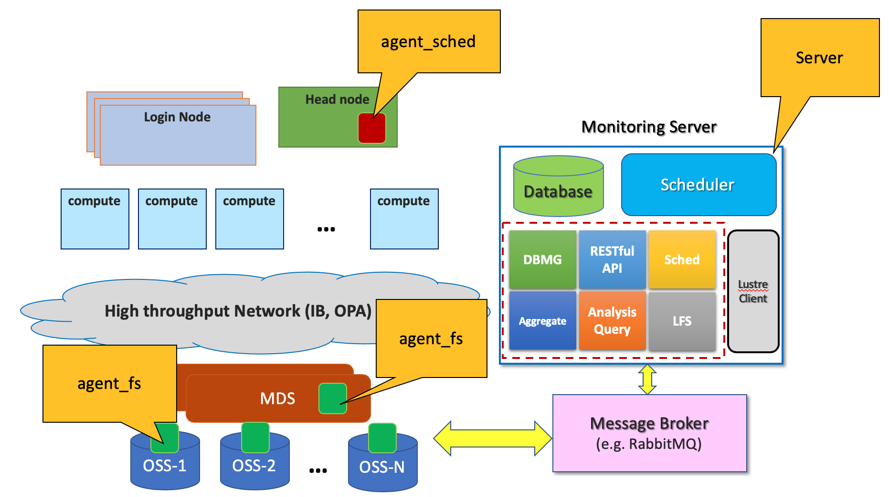

# HPC_Provenance
Provenance Service for HPC Clusters

**Introduction:**

In the last few years, significant growth in data processing demands and the emergence of more sophisticated scientific applications on HPC platforms have increased the file-level I/O operations on both local and shared file systems. As a result, HPC users and system administrators have been highly interested in collecting and analyzing I/O statistics of file operations at different granularity levels such as job, application, user or system. On the one hand, collected I/O statistics can be used in Provenance systems in order to describe detailed information about the history of data usage and related elements such as users, processes, jobs, and workflows that contribute to the existence of data. Provenance systems help users better understand what sort of access patterns are common in their application, how their application interacts with storage, and how their applications behave with respect to file I/O operations. On the other hand, system administrators can utilize the collected I/O statistics in order to optimize HPC resource usage due to the high cost of capital, power, maintenance, and manpower. They can also exploit these data to improve the performance of users’ application by finding their I/O bottlenecks and inefficiencies.

 **Architecture Diagram**

 **Requirements:**
*  Compatible with Linux operating systems
*  Python 2.7 and 3.x
*  Python packages:
    *  Pika
    *  python_daemon
*  RabbitMQ with following configuration:
    *  user: monitoring
    *  password: Lu5t3r
    *  vhost: /monitoring
* MongoDB

 **Installation:**
HPC_Provenance consists of three software components which need to be installed on different machines as following:

1.  ***agent_fs:*** The file system componets that has to be installed on every MDSs and OSSs:
    * Make sure Python 2.7 is installed on every Lustre MDS and OSS srvers.
    * Copy the "agent_fs" directory on every MDS and OSS servers.
    * Install the required Python packages by running the `./install_python_packages.py` under "agent_fs/util". (This action does not require internet connection)
    * Start the HPC_Provenance daemon on every MDS and OSS by utilizing the following command under "agent_fs" directory :
        *  `./provenance_fs_agent.py <start | stop | status>`
2.  ***server:*** The main service that should be running on a dedicated server in order to receive/aggregate/store the coolected data from Lustre and Scheduler servers
    * Make sure Python 3.x is installed on the server machine.
    * Copy the "servver" directory on the server machine.
    * Install the required Python packages by running the `./install_python_packages.py` under "server/util". (This action does not require internet connection)
    * Execute the following command from "server/packages" directory (Daemon for this service is under development):
        *  `python3 main_interface.py`
3.  ***agent_sched*** The agent component that collects the essential data from the job scheduler(s), such as UGE, SLURM,...
    *  (Under Development)