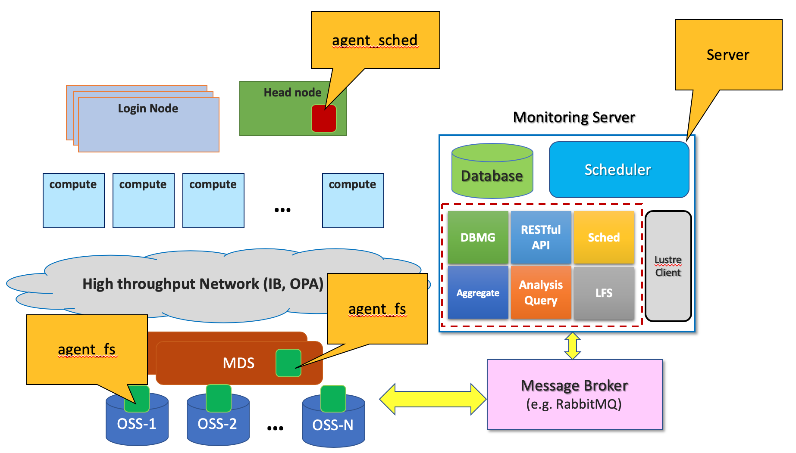

# HPC_Provenance

**Introduction**

In the last few years, significant growth in data processing demands and the emergence of more sophisticated scientific applications on HPC platforms have increased the file-level I/O operations on both local and shared file systems. As a result, HPC users and system administrators have been highly interested in collecting and analyzing I/O statistics of file operations at different granularity levels such as job, application, user or system. On the one hand, collected I/O statistics can be used in Provenance systems in order to describe detailed information about the history of data usage and related elements such as users, processes, jobs, and workflows that contribute to the existence of data. Provenance systems help users better understand what sort of access patterns are common in their application, how their application interacts with storage, and how their applications behave with respect to file I/O operations. On the other hand, system administrators can utilize the collected I/O statistics in order to optimize HPC resource usage due to the high cost of capital, power, maintenance, and manpower. They can also exploit these data to improve the performance of users’ application by finding their I/O bottlenecks and inefficiencies.
&nbsp;
&nbsp;
&nbsp;
&nbsp;
&nbsp;

**Architecture Diagram**

**Installation**

